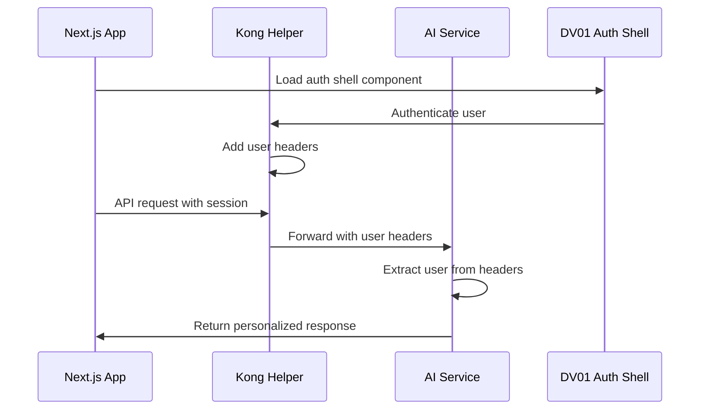

# 🧠 MCP Chat Workspace

A modern, intelligent chat application workspace built with **Next.js** and powered by an **MCP Gateway** for seamless integration with Model Context Protocol servers.

## 🌟 Overview

This workspace demonstrates a complete **"dumb client"** architecture where:
- **Next.js app** handles only UI and user experience
- **AI Service** manages all LLM processing, database operations, and tool orchestration
- **Intelligent routing** automatically selects the best tools for each user request
- **Containerized deployment** with Docker and PostgreSQL

## 🏗️ Architecture

```
┌─────────────────┐    ┌─────────────────┐    ┌─────────────────┐
│   Next.js App   │────│   AI Service    │────│   PostgreSQL    │
│  (Port 3000)    │    │  (Port 8000)    │    │  (Port 5433)    │
│                 │    │                 │    │                 │
│ • UI Components │    │ • Intelligent   │    │ • Chat History  │
│ • Gateway APIs  │    │   Server Route  │    │ • User Data     │
│ • No Database   │    │ • Chat History  │    │ • Persistence   │
│ • No LLM Logic  │    │ • Auth & JWT    │    └─────────────────┘
└─────────────────┘    │ • Database ORM  │
                       └─────────────────┘
                                │
                    ┌─────────────────────────┐
                    │      MCP Servers        │
                    │                         │
                    │ • Playwright (Browser)  │
                    │ • Apollo (Space Data)   │
                    │ • Custom Servers...     │
                    └─────────────────────────┘
```

## 🚀 Quick Start

### Prerequisites
- Node.js 18+
- Podman and Podman Compose (or Docker/Docker Compose)
- pnpm (recommended) or npm
- Git (for submodule management)

### **📋 First Time Setup**

If you're cloning this repo for the first time:

```bash
# Option 1: Clone with submodules (recommended)
git clone --recurse-submodules https://github.com/your-org/mcp-chat-wksp
cd mcp-chat-wksp
pnpm quick-start

# Option 2: Clone then setup
git clone https://github.com/your-org/mcp-chat-wksp
cd mcp-chat-wksp
pnpm quick-start  # This will initialize submodules automatically
```

## **⚡ One Command Setup (Recommended)**

```bash
pnpm quick-start
```

This single command will:
1. ✅ Initialize and update Git submodules (DV01 auth gateway)
2. ✅ Install all workspace dependencies
3. ✅ Install project-specific dependencies (Kong helper, AI service, etc.)
4. ✅ Add missing Next.js dependencies (`next-intl`)
5. ✅ Copy environment file templates (`.env.example` → `.env`)
6. ✅ Start Kong helper + AI service containers + Next.js app

### **🔄 For Latest Gateway Updates**

```bash
# Pull latest DV01 gateway changes
git submodule update --remote

# Or include in setup
pnpm setup  # Always pulls latest gateway
```

## **🔧 Manual Setup (Alternative)**

### 1. Install Dependencies
```bash
pnpm install
```

### 2. Configure Environment
```bash
# Set up Kong helper for DV01 auth
cd tools/localhost-kong-helper
cp example.env .env
# Edit .env with your DV01 credentials

# Set up AI service for Kong auth
cd apps/ai-service
cp .env.example .env
# Edit .env to set USE_KONG_AUTH=true

# Set up Next.js for DV01 auth
cd apps/mcp-chat-app
cp .env.local.example .env.local
```

### 3. Install Dependencies
```bash
# Install Kong helper dependencies
pnpm kong-helper:install

# Install workspace dependencies
pnpm install
```

### 4. Start All Services

**Option A: With DV01 Auth (Recommended)**
```bash
# Starts Kong helper + AI service + Next.js
pnpm dev:with-auth
```

**Option B: Full Stack with MCP Servers**
```bash
# Starts everything including MCP servers
pnpm dev:full-stack
```

**Option C: Manual Setup**
```bash
# Start containerized AI service with PostgreSQL
pnpm containers:up

# Start Kong helper for auth simulation
pnpm kong-helper:serve

# Start Next.js app
pnpm dev

# Start MCP servers (optional)
pnpm playwright-mcp:serve    # Browser automation
pnpm apollo-mcp:serve        # Space data
```

### 5. Open Application
- **Chat App**: http://localhost:3000
- **Kong Helper**: http://localhost:3001
- **AI Service API**: http://localhost:8000
- **Health Check**: http://localhost:8000/health

## 📁 Workspace Structure

```
mcp-chat-workspace/
├── apps/
│   ├── mcp-chat-app/          # Next.js chat application
│   │   ├── src/
│   │   │   ├── app/           # App router pages
│   │   │   ├── components/    # React components
│   │   │   └── lib/           # Utilities
│   │   └── package.json
│   │
│   ├── ai-service/             # FastAPI AI backend service
│   │   ├── mcp_gateway/       # Python source code (legacy name)
│   │   ├── Dockerfile         # Container definition
│   │   ├── docker-compose.yml # Multi-service setup
│   │   ├── README.md          # Detailed service docs
│   │   └── DOCKER.md          # Container deployment guide
│   │
│   ├── playwright-mcp/        # Browser automation server
│   └── apollo-mcp/            # Space data server
│
├── tools/
│   └── localhost-kong-helper/ # DV01 Kong auth helper (submodule)
│
├── package.json               # Workspace scripts
├── nx.json                    # Nx configuration
└── README.md                  # This file
```

## 🔐 DV01 Authentication Integration

This workspace supports **DV01's enterprise authentication strategy** using Kong gateway integration:

### **Authentication Flow**
1. **Auth Shell Component**: Each app imports DV01's static web component for authentication
2. **Kong Gateway**: All requests pass through Kong which adds user headers
3. **Localhost Helper**: Simulates the Kong auth flow for local development
4. **AI Service**: Extracts user info from Kong headers instead of JWT tokens

### **Key Benefits**
- **Unified Auth**: Same auth strategy across all DV01 applications
- **No Direct Auth0**: Apps never call Auth0 directly - all through Kong
- **Development Simulation**: Localhost helper mimics production auth flow
- **Per-User Chat Tracking**: AI service tracks chats per authenticated user

### **How It Works**



### **Kong Headers**
The AI service expects these headers from Kong:
- `currentuser`: Base64 encoded user JSON
- `accesstoken`: OAuth access token
- `currentorg`: Current organization ID

## 🛠️ Development Commands

### Container Management
```bash
# Start all containers
pnpm containers:up

# Check container status
pnpm containers:status

# View container logs
pnpm containers:logs

# Stop all containers
pnpm containers:down

# Restart with rebuild
pnpm containers:restart
```

### Quick Commands
```bash
# 🚀 Complete setup and start (one command)
pnpm quick-start

# 🔧 Setup only (install deps + copy env files)
pnpm setup

# 🏁 Start everything (assumes setup is done)
pnpm start:all

# 🔑 Start with DV01 auth only
pnpm dev:with-auth

# 📚 Start full stack with all MCP servers
pnpm dev:full-stack
```

### Individual Service Management
```bash
# Install Kong helper dependencies
pnpm kong-helper:install

# Start Kong helper for auth simulation
pnpm kong-helper:serve

# Install all project dependencies at once
nx run-many --target=install --parallel
```

### Application Development
```bash
# Start Next.js app
pnpm dev

# Build for production
pnpm build

# Run tests
pnpm test

# Lint code
pnpm lint

# Format code
pnpm format
```

### MCP Server Management
```bash
# Start Playwright MCP server
pnpm playwright-mcp:serve

# Start Apollo MCP server
pnpm apollo-mcp:serve

# Build MCP servers
pnpm playwright-mcp:build
```

### AI Service Development
```bash
# Start AI service locally (for development)
pnpm ai-service:serve

# Run AI service tests
pnpm ai-service:test

# Check service status
curl http://localhost:8000/health
```

## 🧠 Intelligent Features

### Automatic Server Selection
The AI service automatically routes user requests to the best MCP server:

**Browser Tasks** → Playwright Server
- "Take a screenshot of google.com"
- "Navigate to github.com and click sign in"
- "Extract text from the homepage"

**Space Data** → Apollo Server
- "Who are the astronauts in space?"
- "Show me upcoming SpaceX launches"
- "Tell me about Mars missions"

### Natural Language Interface
```javascript
// Simple API call - no tool knowledge required
const response = await fetch('/api/chat', {
  method: 'POST',
  body: JSON.stringify({
    messages: [
      { role: 'user', content: 'Take a screenshot of apple.com' }
    ]
  })
});
```

## 🐳 Container Deployment

### Using Nx (Recommended)
```bash
# Single command to start everything with Podman
pnpm containers:up
```

### Using Podman Compose
```bash
cd apps/ai-service
podman compose up -d
```

### Using Docker Compose (Alternative)
```bash
cd apps/ai-service
docker compose up -d
```

### Environment Variables
Create `apps/ai-service/.env`:
```bash
ANTHROPIC_API_KEY=your_anthropic_key
OPENAI_API_KEY=your_openai_key
```

## 📊 Monitoring

### Health Checks
```bash
# AI service health
curl http://localhost:8000/health

# Next.js app
curl http://localhost:3000/api/health

# Container status
pnpm containers:status
```

### Logs
```bash
# All container logs
pnpm containers:logs

# AI service logs only
podman compose -f apps/ai-service/docker-compose.yml logs -f ai-service

# Next.js logs
pnpm dev
```

## 🎯 Key Benefits

### For Developers
- **Zero AI Complexity**: Next.js app has no LLM or MCP knowledge
- **Universal Integration**: Any client can integrate via simple HTTP APIs
- **Intelligent Routing**: AI service automatically selects optimal LLMs and tools
- **Containerized**: Easy deployment and scaling

### For Users
- **Natural Language**: Just describe what you want
- **Multi-Tool Access**: Browser automation, data queries, and more
- **Persistent History**: All conversations saved and searchable
- **Real-Time Responses**: Streaming AI responses

### For Operations
- **Scalable Architecture**: Independent scaling of components
- **Health Monitoring**: Built-in health checks and observability
- **Database Persistence**: PostgreSQL for production reliability
- **Container Orchestration**: Docker Compose for easy deployment

## 🔧 Customization

### Adding New MCP Servers

1. **Create Server**: Add to `apps/` directory
2. **Configure AI Service**: Update `AVAILABLE_SERVERS` in service
3. **Add Keywords**: Define routing keywords for intelligent selection
4. **Test Integration**: Verify routing with test prompts

### Extending the Chat App

1. **Add Components**: Create new React components in `src/components/`
2. **New Pages**: Add routes in `src/app/`
3. **API Integration**: Use gateway APIs in `src/app/api/`
4. **Styling**: Customize with Tailwind CSS

### Environment Configuration

**Development**:
- Mock authentication enabled
- SQLite database (optional)
- Hot reload for all services

**Production**:
- JWT authentication required
- PostgreSQL database
- Optimized container builds

## 🧪 Testing

### Automated Tests
```bash
# Run all tests
pnpm test

# Test specific projects
nx test mcp-chat-app
nx test ai-service
```

### Manual Testing
```bash
# Test containerized setup
node test-containerized-gateway.js

# Test database migration
node test-database-migration.js
```

### API Testing
```bash
# Test intelligent routing
curl -X POST http://localhost:8000/mcp/chat \
  -H "Authorization: Bearer mock-token" \
  -H "Content-Type: application/json" \
  -d '{"prompt": "Take a screenshot of github.com"}'
```

## 📚 Documentation

- **[AI Service README](apps/ai-service/README.md)**: Complete service documentation
- **[Docker Guide](apps/ai-service/DOCKER.md)**: Container deployment guide
- **[Next.js App](apps/mcp-chat-app/README.md)**: Frontend application docs
- **[Nx Documentation](https://nx.dev)**: Monorepo tooling

## 🤝 Contributing

1. **Fork the repository**
2. **Create feature branch**: `git checkout -b feature/amazing-feature`
3. **Commit changes**: `git commit -m 'Add amazing feature'`
4. **Push to branch**: `git push origin feature/amazing-feature`
5. **Open Pull Request**

### Development Guidelines
- Follow existing code conventions
- Add tests for new features
- Update documentation
- Ensure containers build successfully

## 🏷️ License

MIT License - see [LICENSE](LICENSE) file for details.

## 🙏 Acknowledgments

- **[Model Context Protocol](https://modelcontextprotocol.io/)**: For the MCP specification
- **[Nx](https://nx.dev)**: For monorepo tooling and optimization
- **[FastAPI](https://fastapi.tiangolo.com/)**: For the high-performance Python API
- **[Next.js](https://nextjs.org/)**: For the React framework
- **[@nx-tools/nx-container](https://github.com/gperdomor/nx-tools)**: For container integration

---

## 🚀 Legacy Components (Available but Superseded)

This workspace also includes legacy components that demonstrate alternative approaches:

### Legacy Projects
- **`mcp-gateway-java`** - Java Spring Boot MCP gateway (superseded by Python AI service)
- **Legacy database setup** - Individual database per service (superseded by centralized gateway database)

### Legacy Commands
```bash
# Java gateway (legacy)
pnpm mcp-gateway-java:serve

# Legacy database setup
npx nx run mcp-chat-app:db:push
```

The current architecture focuses on the Python AI service with centralized database management for optimal performance and simplicity.